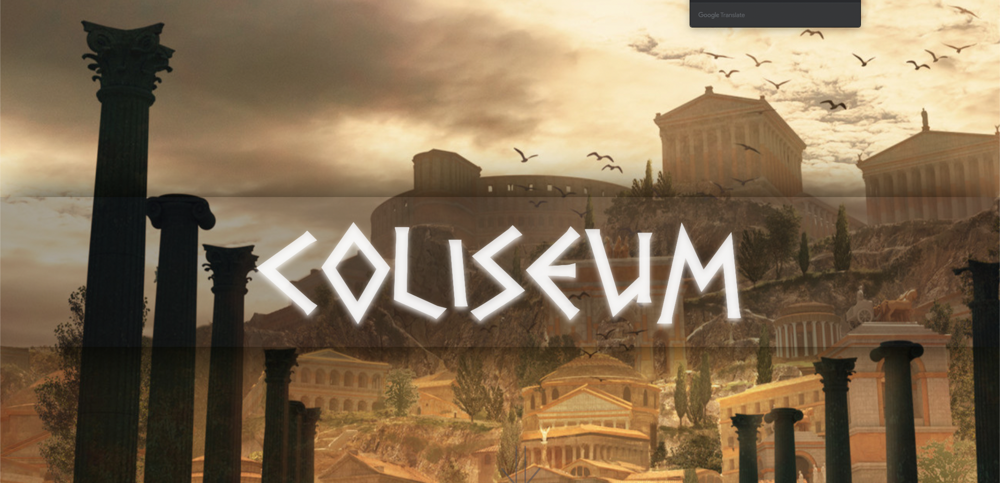
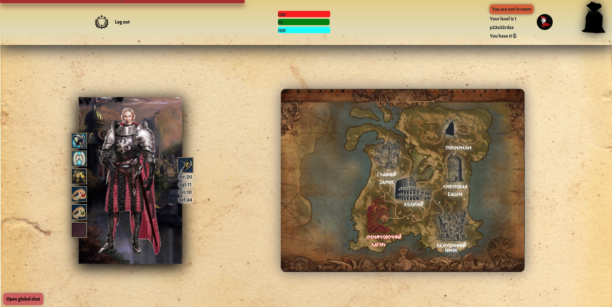
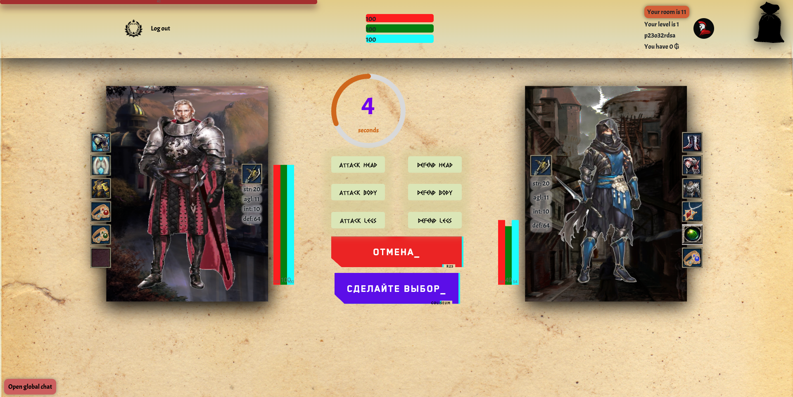
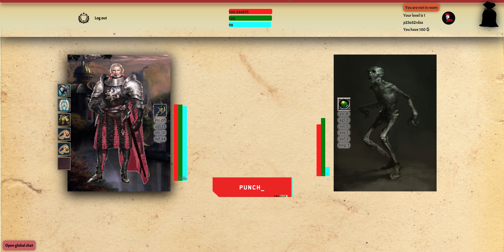

## COLISEUM

#### https://dbforgame.herokuapp.com/

#### The browser MMORPG game to fight against monsters and another players, watch battles, take gold, exp and items for wins.

#### Built with React, Redux, Socket-io, JWT, Node.js, Express, Postgres, JavaScript, and CSS.

#### Project has backend, which is in another repository and also deployed with actual Game Build on '/'

## Project Screen Shots

## Installation and Setup Instructions

#### Example:

Clone down this repository. You will need `node` and `npm` installed globally on your machine.

Installation:

`npm install`

To Start Server:

`npm start`

To Visit App:

`localhost:3000/`

## Game story

The liberation of Grim gold

Introduction:
Welcome to Grimgold! Everything you need to know, you will understand intuitively, because the magical world
whose call you hear is extremely similar to ours. One of the allied countries of the Grand Alliance was hit
from outside. The ruler of the skeleton state, with the help of his henchmen, captured the castle, and with it
the entire capital of the human continent. The locals fled the city in horror, but a considerable part of the
townspeople collected the amount with which they turned to the guild of mercenaries. Justice must prevail!
The video sequence ends here and three heroes to choose from appear before our eyes.

* choose the class of your character and give him a name * after we get to the first location.

#### Collaborators:

##### https://github.com/d4rsen

##### https://github.com/compampa

##### https://github.com/CainStr